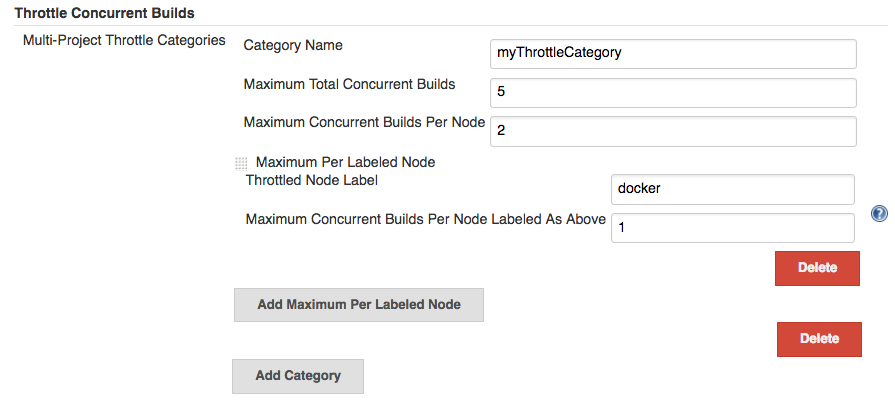

# Throttle Concurrent Builds Plugin

[](https://ci.jenkins.io/job/Plugins/job/throttle-concurrent-builds-plugin/job/master/)
[](https://github.com/jenkinsci/throttle-concurrent-builds-plugin/graphs/contributors)
[](https://plugins.jenkins.io/throttle-concurrents)
[](https://github.com/jenkinsci/throttle-concurrent-builds-plugin/releases/latest)
[](https://plugins.jenkins.io/throttle-concurrents)

## Introduction

This plugin allows for throttling the number of concurrent builds of a
project running per node or globally.

## Getting started

This plugin supports three modes:

* Throttling of runs by one or multiple category
* Throttling of multiple runs of the same `AbstractProject` job (not
  recommended)
* Throttling of runs by parameter values

For each mode it is possible to setup global, label-specific, and
node-specific limits for concurrent runs. If multiple throttling
categories are defined, each requirement needs to be satisfied in order
for the task to be taken off the queue.

Usage specifics:

* If the throttling category cannot be satisfied, the task submission
  stays in the queue until the locked category becomes available. The
  submission can be terminated manually or by timeout.
* This plugin throttles tasks only only on common executors. Flyweight
  tasks are not throttled.
* If the jobs are organized into a chain (e.g., via Parameterized Trigger
  build steps), each run in the chain is counted independently. For
  example, if _ProjectA_ and _ProjectB_ use category `cat_A` on the same
  node, two executors are required from the category pool. Improper
  configuration of categories/jobs may result in a deadlock of such build
  chains due to consumption of all executors and waiting for downstream
  executions blocked in the queue.

### Global configuration

Global configuration allows defining global categories. For each category
you can set up global, label-specific, and node-specific restrictions for
executor numbers. After configuration, it is possible to select and use
the categories in job configurations. For example:



To set an unlimited value of concurrent builds for a restriction, use
`0`.

### Throttling of classic job types

Classic job types (e.g., Freestyle, Matrix, and Job DSL) can be
configured via job properties in the job configuration screen. For
example:


There are two modes: _Throttle this project alone_ and _Throttle this
project as part of one or more categories_. Only one mode can be
enabled.

* _Throttle this project alone_
  * For this option you should configure _Maximum Total Concurrent
    Builds_ and/or _Maximum Concurrent Builds Per Node_.
  * To set an unlimited value of concurrent builds for a restriction,
    use `0`.
  * With this option categories are ignored.
* _Throttle this project as part of one or more categories_
  * For this option you should specify enabled categories using
    checkboxes.
  * With this option the _Maximum Total Concurrent Builds_ and _Maximum
    Concurrent Builds Per Node_ fields are ignored.
* _Prevent multiple jobs with identical parameters from running
  concurrently_
  * This option adds additional throttling by parameter values.

For Matrix projects the property offers two additional checkboxes, which
define throttling behavior for Matrix master runs and configuration
runs. For example:


### Throttling of Pipeline jobs

<!--TODO: Remove warning once JENKINS-31801 is integrated-->

#### throttle() step

Starting in `throttle-concurrents-2.0`, this plugin allows throttling of
particular Pipeline blocks by categories. For this purpose you can use the
`throttle()` step.

How does it work?

* If a `throttle()` step is used, all explicit and implicit `node()`
  invocations within this step are throttled.
* If a `node()` step is used within a `parallel()` block, each parallel
  branch is throttled separately.
* Throttling of Pipeline steps in `throttle()` takes precedence over
  other throttling logic, such as job properties in Pipeline and other
  job types.
* If the specified category is missing, `throttle()` execution fails the
  run.

#### Warning regarding restarting the Jenkins master

:exclamation: Due to a deadlock (as described in
[JENKINS-44747](https://issues.jenkins-ci.org/browse/JENKINS-44747)), a
change has been made which can theoretically result in throttle
categories being ignored in running Pipelines immediately after the
Jenkins master has been restarted. This will be investigated further in
[JENKINS-44756](https://issues.jenkins-ci.org/browse/JENKINS-44756) but
was considered necessary in order to resolve the deadlock scenario.

## Examples

### Example 1: Throttling of node() runs

```groovy
// Throttle a single operation
throttle(['test_2']) {
    node() {
        sh "sleep 500"
        echo "Done"
    }
}
```

### Example 2: Throttling of parallel steps

```groovy
// The script below triggers 6 subtasks in parallel.
// Then tasks are throttled according to the category settings.
def labels = ['1', '2', '3', '4', '5', '6']
def builders = [:]
for (x in labels) {
    def label = x // Need to bind the label variable before the closure

    // Create a map to pass in to the 'parallel' step so we can fire all the builds at once
    builders[label] = {
      node('linux') {
        sh "sleep 5"
      }
    }
}

throttle(['myThrottleCategory1', 'myThrottleCategory2']) {
  parallel builders
}
```

### Example 3: Throttling of declarative pipelines

```groovy
pipeline {
    agent any

    // Throttle a declarative pipeline via options
    options {
        throttle(['test_3'])
    }

    stages {
        stage('sleep') {
            steps {
                sh "sleep 500"
                echo "Done"
            }
        }
    }
}
```

## Unsupported use cases

This section contains links to the use cases which **are not
supported**.

### Throttling of code blocks without a `node()` definition

A feature request is logged as
[JENKINS-44411](https://issues.jenkins-ci.org/browse/JENKINS-44411).

### Throttling Pipeline via Job properties

:exclamation: **Warning!** Starting in `throttle-concurrents-2.0`, using
this option is not recommended. Use the `throttle()` step instead.

Starting in `throttle-concurrents-1.8.5`, this plugin supports the
definition of throttling settings via job properties. The behavior of
such definition **may differ** from your expectation and **may change**
in new plugin versions.

Current behavior:

* If the property is defined, Pipeline jobs are throttled as any
  other project.
* Pipeline jobs are throttled on the top level as a single instance. They
  are considered a single job even if there are declarations like
  `parallel()`.
* Node requirements are considered for the root Pipeline task only,
  so effectively only the master node is checked.

Use this option at your own risk.

## License

[MIT License](http://www.opensource.org/licenses/mit-license.php)

## Changelog

* [Changelog](CHANGELOG.md)

## Issues

Report issues and enhancements in the [Jenkins issue tracker](https://issues.jenkins-ci.org/).
Use the `throttle-concurrent-builds-plugin` component in the `JENKINS` project.

## Contributing

Refer to our [contribution guidelines](https://github.com/jenkinsci/.github/blob/master/CONTRIBUTING.md).
